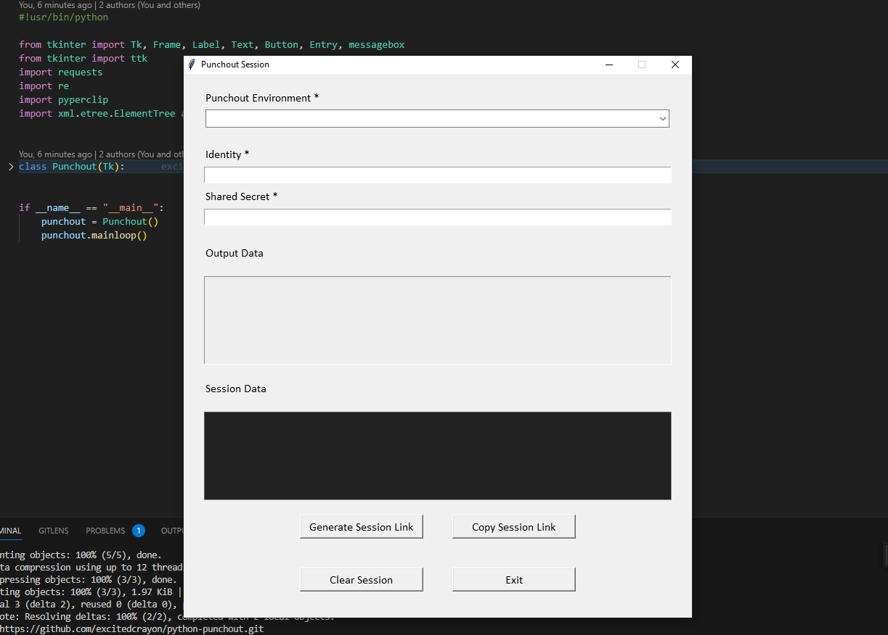
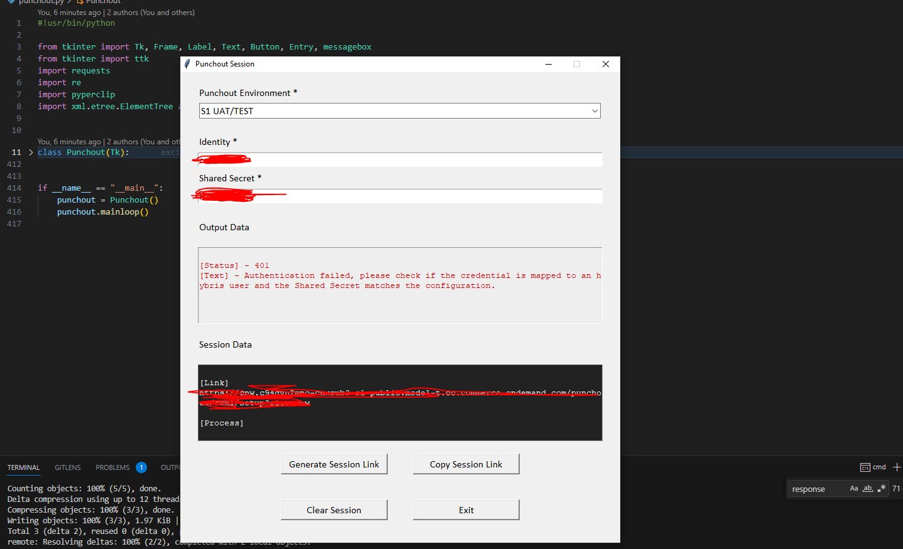
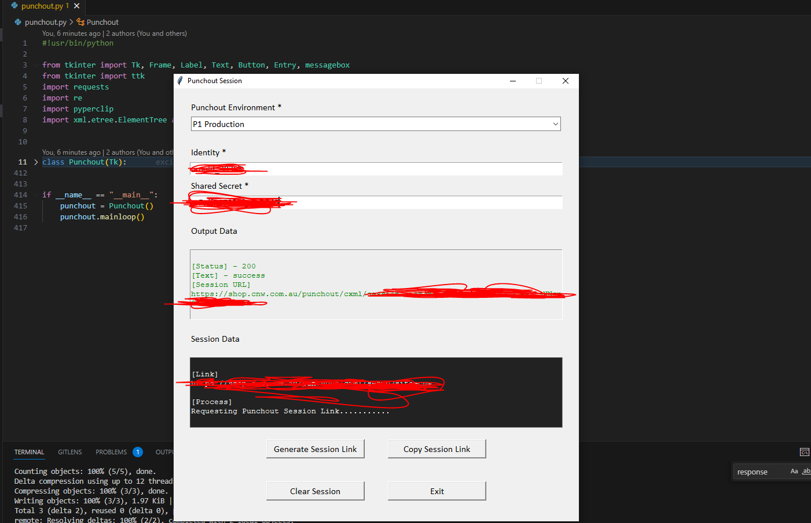
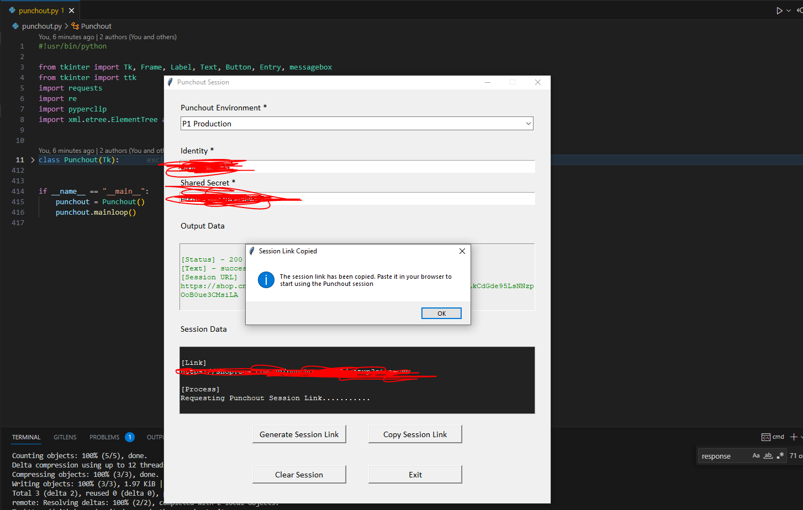

# python-punchout

Generate Punchout Session

## Basic Demonstration Of Program

The Punchout program uses the following tools

- Compiled using Python 3.10
- Tkinter to build the GUI (Graphical User Interface)
- Requests module for http post request
- Re for regex pattern matching
- Pyperclip for coping the session link to the OS clipboard
- xml.etree.ElementTree fror parsing between string and XML data type
- Auto-PY to generate an executable file

* Starting up the program
  

* Using wrong credentials for obtaining a session
  

* Using correct credentials for obtaining a session
  

* Dialog messagebox when 'Copy Session Link' button is clicked
  

This program was written by myself during my time at BGW Group to make use of a semi-automated process in creating Punchout2Go sessions for customers using cXML
